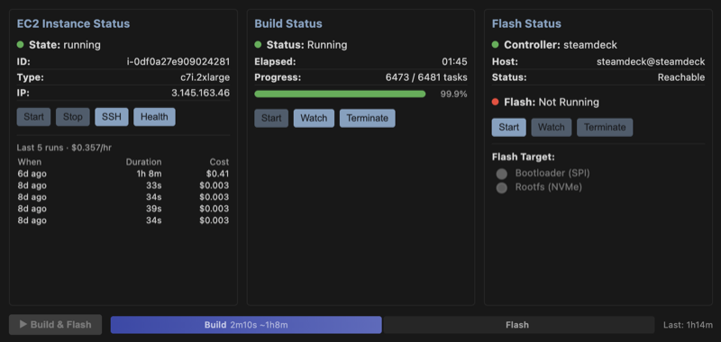
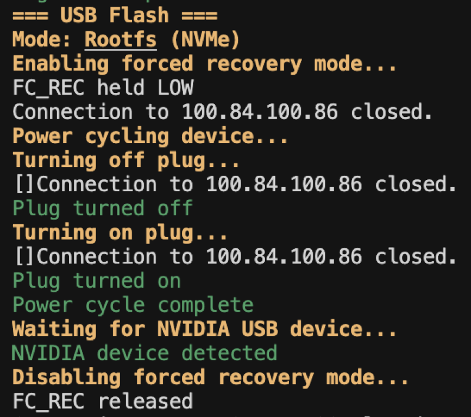

# Edge AI

Secure edge computing platform for NVIDIA Jetson devices. Features read-only rootfs with signed container deployments via AWS IoT.

## Stack

- **Image**: Yocto/OE with L4T + CUDA + TensorRT
- **Infra**: AWS IoT Fleet Provisioning, ECR, KMS container signing
- **App**: Wildlife detection camera (YOLOv8 → TensorRT)

## Quick Start

```bash
# Build firmware image
make firmware-build

# Deploy app to device (sandbox mode)
make firmware-app-sandbox APP=squirrel-cam DEVICE=192.168.86.34

# Production deploy (signed)
make firmware-app-push APP=squirrel-cam VERSION=v1
make firmware-app-deploy APP=squirrel-cam DEVICE=192.168.86.34 VERSION=v1
```

## Screenshots

<p align="center">
  
  
</p>

<p align="center">
  
  
  
</p>
